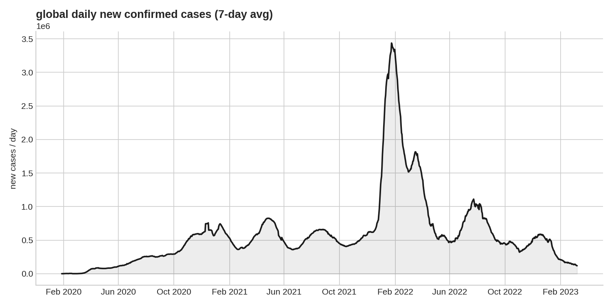
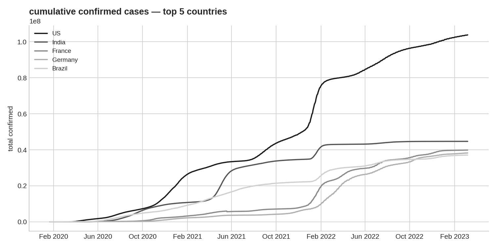
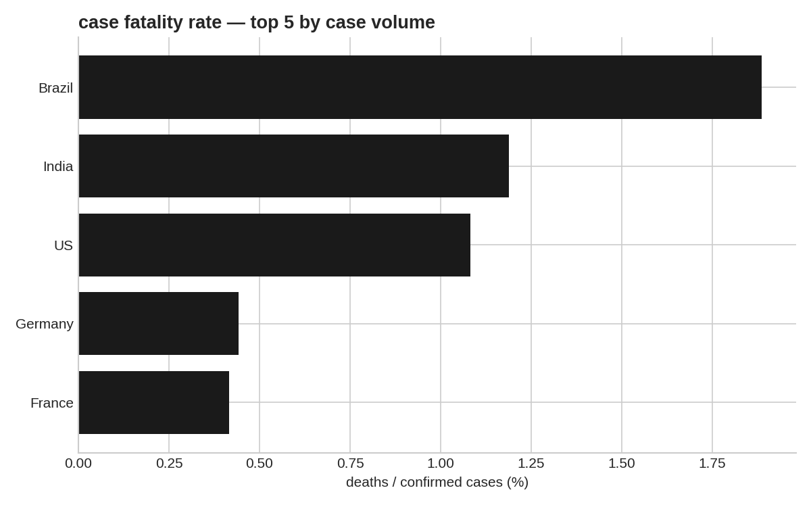

<div align="center">

# patient-zero-to-insight

*raw case counts, timestamps, and a search for the signal inside a global pandemic*


</div>

---

### table of contents

- [the story](#the-story)
- [what this explores](#what-this-explores)
- [the dataset](#the-dataset)
- [tech stack](#tech-stack)
- [the analysis journey](#the-analysis-journey)
- [key findings](#key-findings)
- [visuals](#visuals)
- [running it locally](#running-it-locally)
- [project structure](#project-structure)
- [what stuck with me](#what-stuck-with-me)

---

### the story

Somewhere between a spreadsheet of daily case counts and a headline that says "the curve is flattening," there's a lot of unglamorous work — cleaning messy timestamps, deciding what counts as an outlier, choosing which chart actually tells the truth instead of just looking dramatic.

This project is that work. It takes raw COVID-19 case and death data and walks it, step by step, from noise to something you could actually explain to another human being — how the virus moved, where it moved fastest, and what the numbers stop hiding once you look at them the right way.

Not a dashboard. Not a template. A record of asking the data one honest question at a time.

---

### what this explores

- How case and death counts evolved over time, globally and by region
- Where growth accelerated vs. where it plateaued — and what that reveals about wave timing
- Which countries carried the heaviest case load, and how their fatality rates actually compared
- What the data *doesn't* say, and where correlation quietly stops being causation

---

### the dataset

[Johns Hopkins CSSE COVID-19 time series data](https://github.com/CSSEGISandData/COVID-19) — daily confirmed cases and deaths by country, **22 Jan 2020 to 9 Mar 2023** (the full span covered before JHU stopped daily updates). Reshaped from wide (one column per date) to long format and aggregated from province-level to country-level.

---

### tech stack

| layer | tools |
|---|---|
| data wrangling | `pandas`, `numpy` |
| visualization | `matplotlib`, `seaborn` |
| environment | jupyter notebook |

---

### the analysis journey

```
load & inspect  →  clean  →  explore  →  visualize  →  interpret
```

1. **load & inspect** — raw CSVs in, first look at shape, nulls, date formatting issues
2. **clean** — collapsed province-level rows into country totals, converted date columns into a proper time index
3. **explore** — daily new cases via `.diff()`, smoothed with a 7-day rolling average to cut day-of-week reporting noise
4. **visualize** — global trend line, top-5-country comparison, case fatality rate bar chart
5. **interpret** — turned three charts into three defensible, specific claims (below)

---

### key findings

- **The Omicron wave was the sharpest spike in the entire dataset.** Global daily new cases (7-day avg) peaked at **~3.44M/day on 24 Jan 2022** — over 4x higher than the previous largest wave (Delta, ~830K/day mid-2021). No other point in the two-year window comes close.
- **Case totals don't track population the way you'd expect.** The US recorded **103.8M** total confirmed cases by the dataset's end — more than double India's **44.7M**, despite India's population being roughly 4x larger. That gap says as much about testing capacity and reporting infrastructure as it does about actual spread.
- **Case fatality rate varied far more than case volume did.** Among the five countries with the most cases, Brazil's CFR (**1.89%**) was over 4x France's (**0.42%**) and Germany's (**0.44%**) — a difference too large to explain by the virus alone, and a good entry point into discussing healthcare capacity and reporting standards rather than just "the numbers."

---

### visuals

**global daily new cases, 7-day average — the Omicron spike dwarfs every earlier wave**


**cumulative confirmed cases — top 5 countries by volume**


**case fatality rate — same top 5, a very different ranking**


---

### running it locally

```bash
git clone <your-repo-url>
cd patient-zero-to-insight

python -m venv venv
source venv/bin/activate        # windows: venv\Scripts\activate

pip install -r requirements.txt
jupyter notebook
```

Open the main `.ipynb` file and run cell by cell — every step is commented so the logic is traceable, not just the output.

---

### project structure

```
patient-zero-to-insight/
├── data/                 raw + cleaned datasets
├── notebooks/            main analysis notebook
├── assets/               chart images used in this README
├── requirements.txt
└── README.md
```

---

### what stuck with me

Numbers about a pandemic stop being abstract pretty fast once you're the one cleaning them. This project was less about impressive charts and more about the discipline underneath them — asking "does this visualization tell the truth, or just look good" every single time.

<div align="center">

*built while learning to read data instead of just plotting it*

</div>
